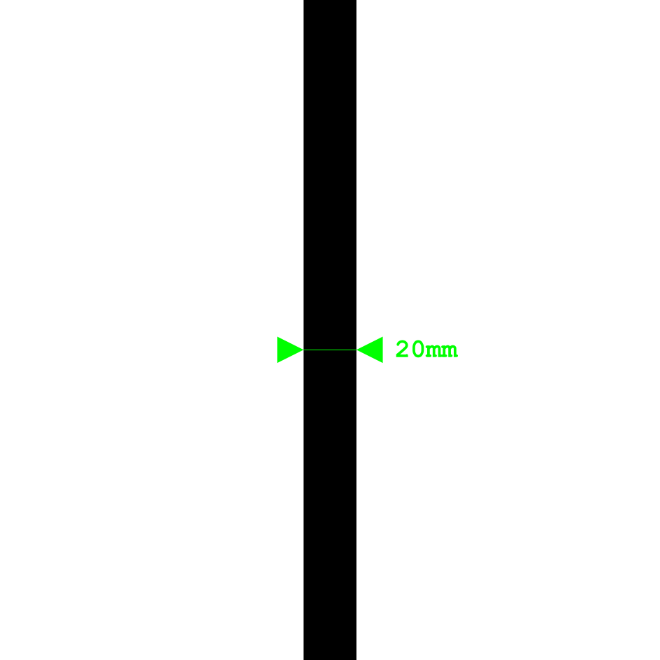
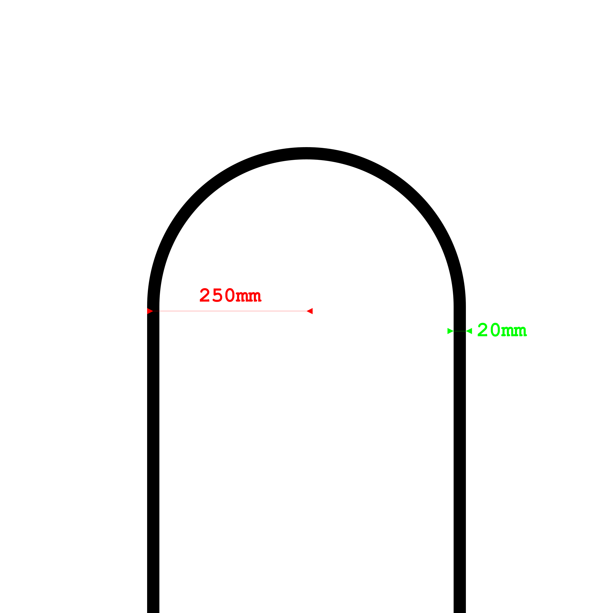
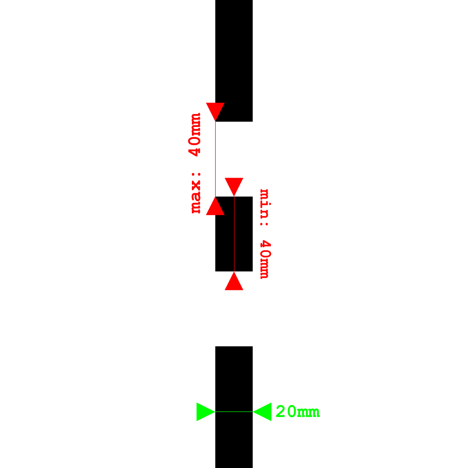
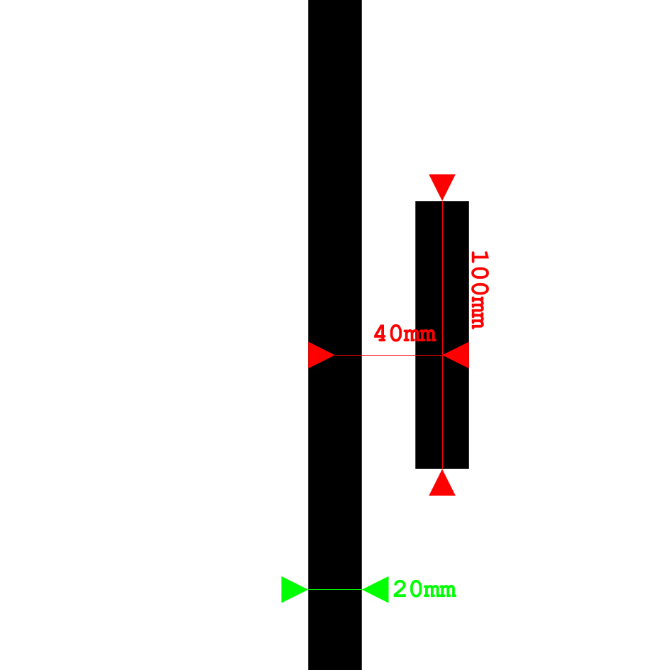
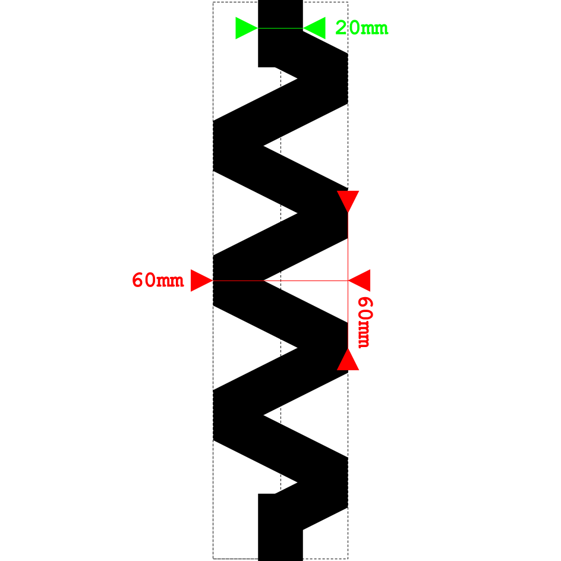

# Line Follower Competition Rules

## Track Features

### Nominal Line
**Description:** Standard track line with no added challenge; used in straight or curved sections between other features.  
**Key Specs (Max / Min):** Width: 20 mm; continuous, high-contrast black line on white surface.  

---

### Start Box
**Description:** Designated starting area where the robot must be fully placed before the run begins. Ensures consistent positioning and fair starts for all teams. The wheelbase of the robot must be fully inside the box at the start of each run.
**Key Specs (Max / Min):** Rectangular outline, 100 mm wide × 400 mm long; nominal line runs through the center.  

---

### Stop Box
**Description:** The official end of the track. Robots must detect the solid black area and come to a complete stop with their entire chassis fully contained within the box.
**Key Specs (Max / Min):** Solid black rectangle, 250 mm wide × 400 mm long; positioned at the end of the nominal line.  

---

### Turns
**Description:** Track sections that require the robot to perform curved trajectories.
**Key Specs (Max / Min):** Minimum turn radius: 250 mm.  Angle: any (e.g., 90°, 135°, 180°)

---

### Variable Line Width
**Description:** Sections where the line width changes, testing the ability of the robot to adapt to varying coverage of its sensors.  
**Key Specs (Max / Min):** 15 mm (min) to 25 mm (max).  

---

### Line Discontinuities
**Description:** Sections where the line is interrupted, requiring the robot to maintain heading until the line is reacquired.  
**Key Specs (Max / Min):** Gaps up to 40 mm; line segments at least 40 mm.  

---

### Wide Gap Crossing
**Description:** Discontinuities where the line resumes with a possible lateral offset, testing the robot’s recovery behavior.  
**Key Specs (Max / Min):** Gap length: up to 40 mm; Offset: 15–30 mm.  

---

### Fork Path Intersection
**Description:** Intersections where one line continues smoothly while another diverges at 90°. The correct path follows the continuous curvature.  
**Key Specs (Max / Min):** Fork angle: 90°; separation at least 250 mm.  

---

### Fake Parallel Lines
**Description:** Short false lines added alongside the nominal line in straight sections. These are designed to distract the sensors but are not part of the valid path.  
**Key Specs (Max / Min):** Length: up to 100 mm; Separation: 25–40 mm.  

---

### Squiggly Line
**Description:** A line segment with periodic lateral oscillations (e.g., sinusoidal). This replaces a straight line to test stability and filtering in control algorithms.  
**Key Specs (Max / Min):** Amplitude: 60 mm max; Period: 60 mm max; Segment length: up to 1000 mm.  

---
